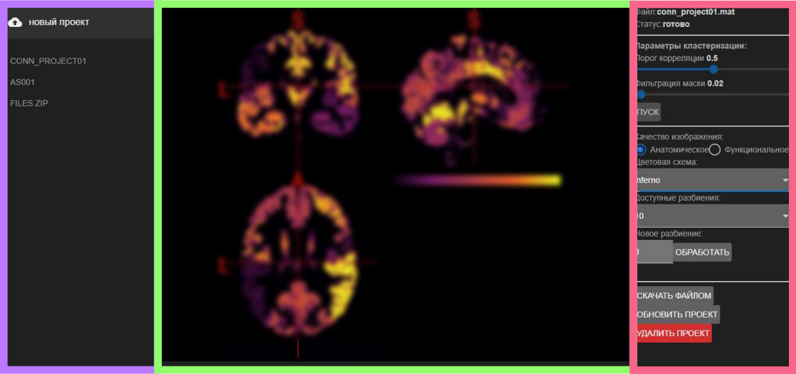
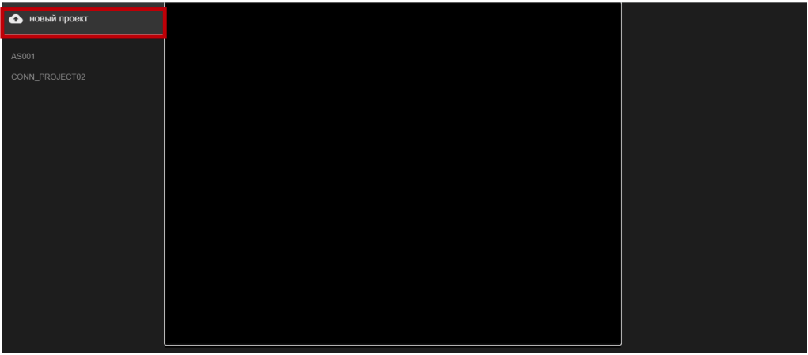
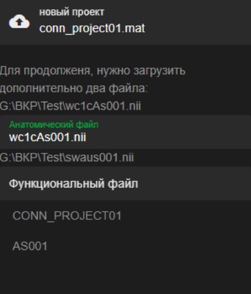
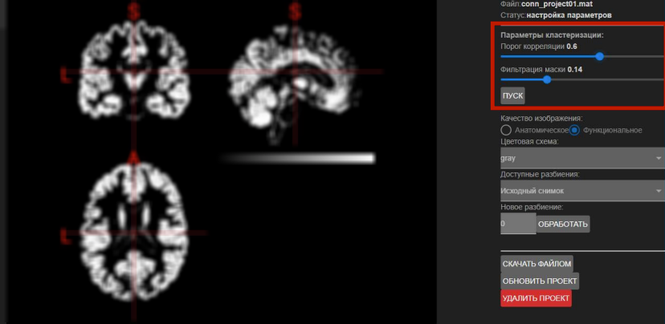
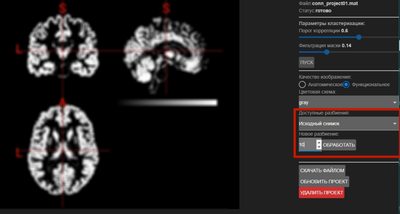
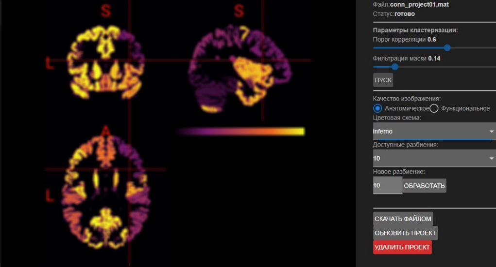
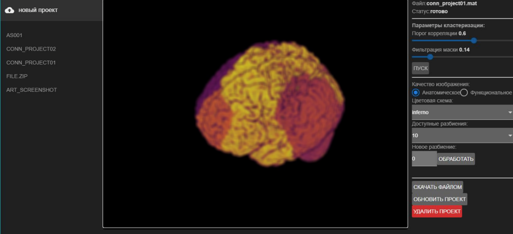

#  Front-end Server

This repo is a front-end side the final qualifying project. The main aim of the web application is to parcellate brain voxels into specific regions based on rs-fMRI data. The algorithm is based on the paper: [Craddock, R. C.; James, G. A.; Holtzheimer, P. E.; Hu, X. P. & Mayberg, H. S.
 A whole brain fMRI atlas generated via spatially constrained spectral
 clustering Human Brain Mapping, 2012, 33, 1914-1928 doi: 10.1002/hbm.21333.](http://www.ncbi.nlm.nih.gov/pubmed/21769991).

 Info about back-end server can be found [here](https://github.com/NVRM0R/vega)

### Table of Content:
+ [General Description](#General-Description)

### General Description
Final qualifing project is a web-based application for fMRI brain research. This part (front-end side) is used to generate HTML-based user interface from one side, and communicate with back server from another.

### GUI

</img>

brain image blurred intentionally

User interface consist of three parts:  

* purple - project selection area  
User can select existing project or create new 
* green - brain exproling area
There user can view parcellated brain in different axes or switch to 3d reconstruction.
* red - area where user can specify project settings, create new parcellation to N areas or download files.  

### Tech specs
To create flexible and efficient application, following stack has been choosen: **javascript + vue.js**

**Quasar framework** has been used for user elements (buttons, text fields, radio switches, etc);

To render brain image slices and complex 3D models, **niivue** package has been used. 

### Demo example
Firstly, user needs to upload files, it can be done by pressing button "new project" ("Новый проект" in russian)

</img>

Then user need to specify files by clicking on filds (open file dialog will be popped out)

</img>

Next, in right section anatomical mask threshold and correlation threshold can be specified. To start first step "calculation correlation marix", used have to press "GO" ("ПУСК" in russian)

</img>

brain image blurred intentionally

After a while, matrix will be calculated and user will be able to select desired amount of ROIs

</img>

brain image blurred intentionally

By selecting one on the color schemes, user can increase the readability of the image as shown below

</img>

brain image blurred intentionally

User also can swtich to 3D mode to rotate and explore brain surface

</img>

brain image blurred intentionally

